# Diagrama de arquitectura
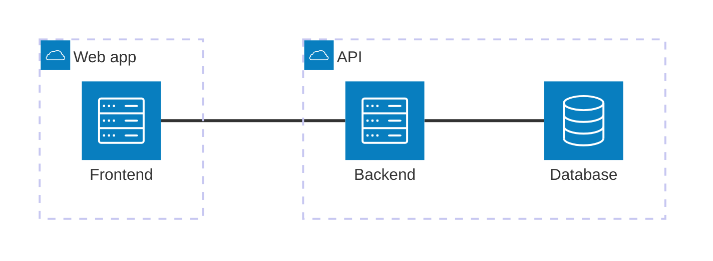
# Diagrama ER

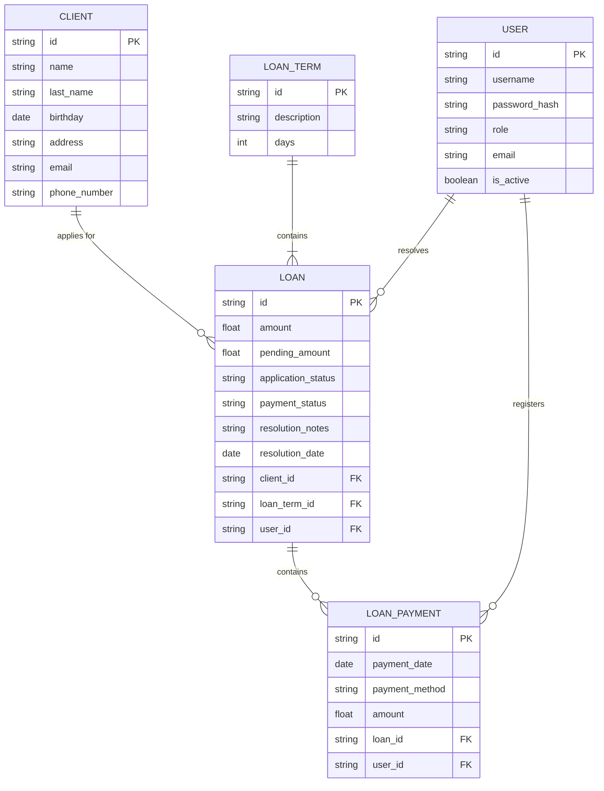
---
# Diagrama de secuencia
## Gestion de clientes
### Agregar clientes

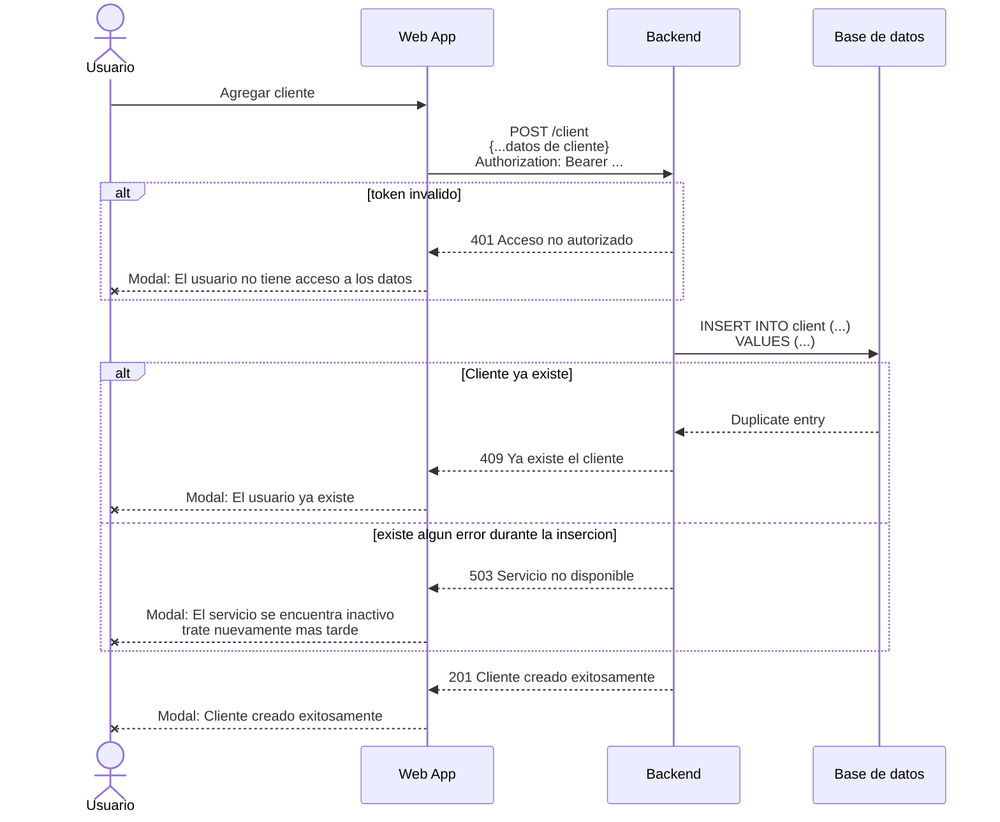
### Listar clientes

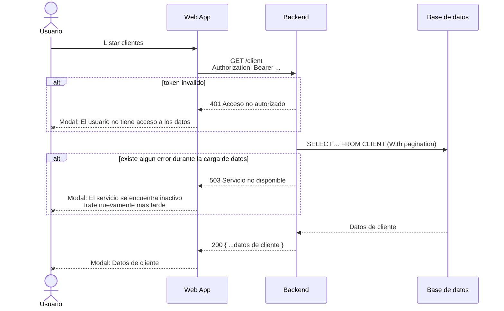
### Editar clientes
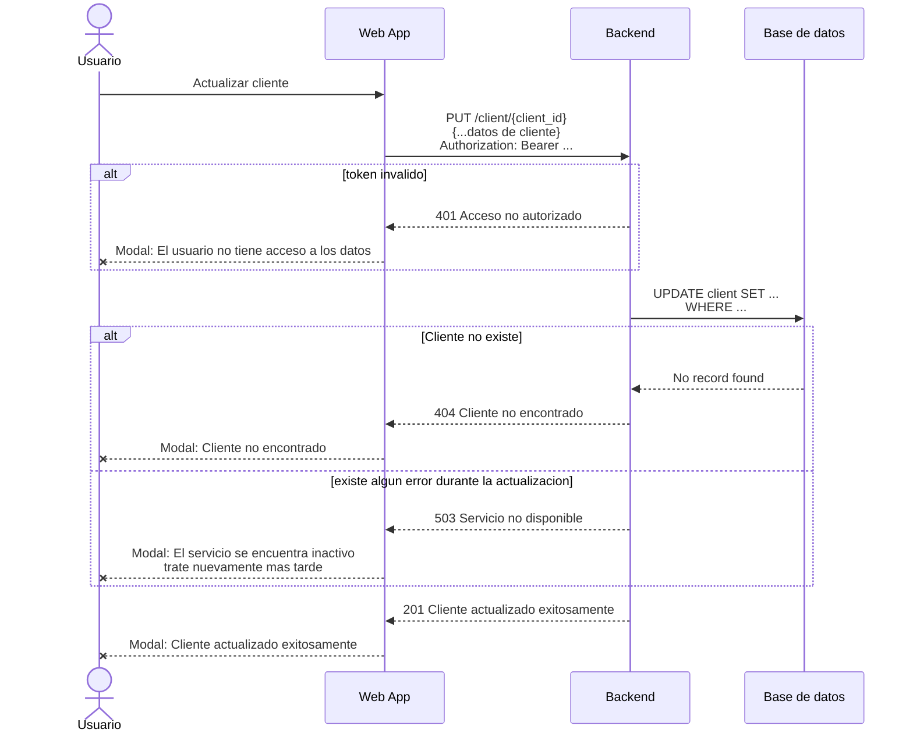
### Eliminar clientes
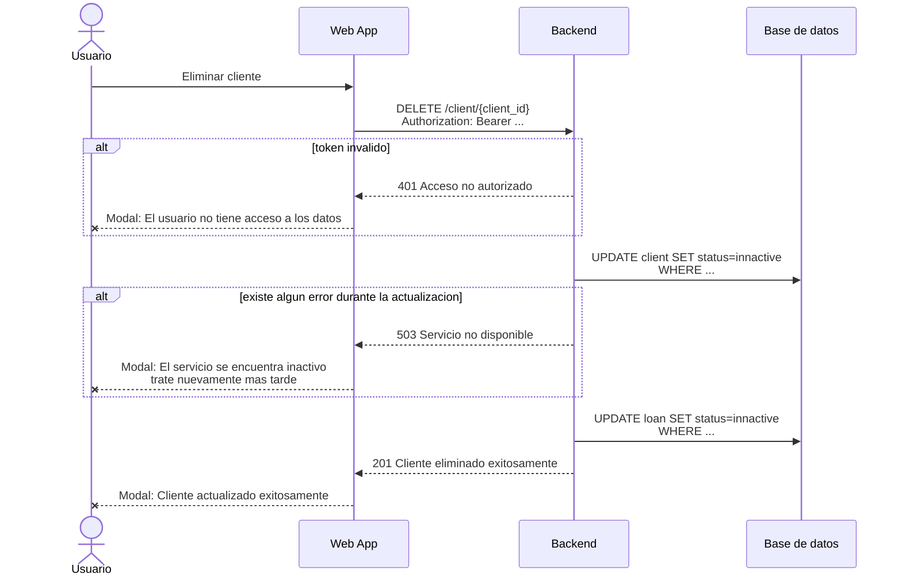

## Solicitud de prestamos
### Solicitar prestamo
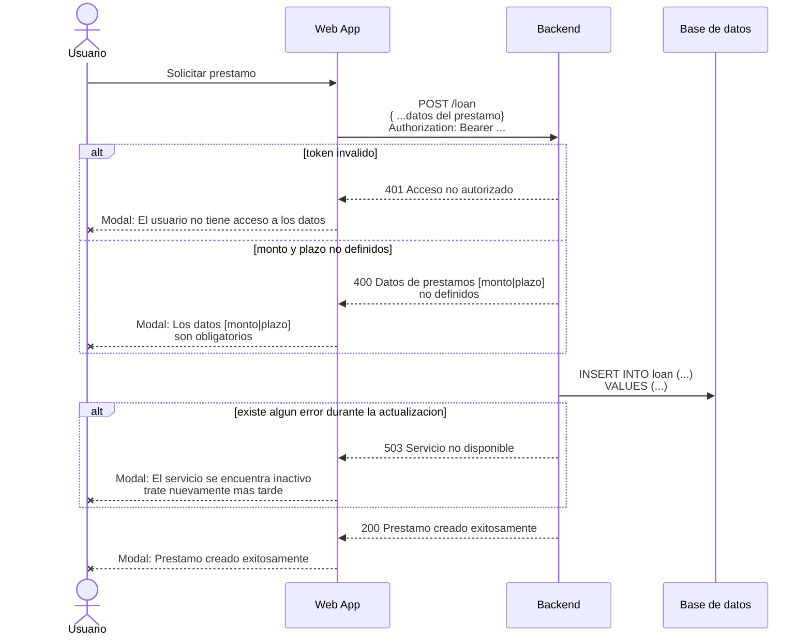
### Listar prestamos por cliente
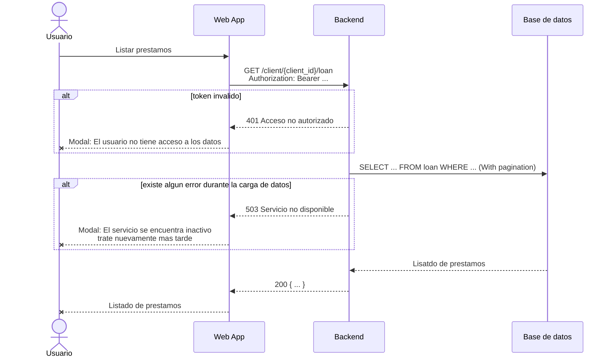
### Aprobar/rechazar prestamo
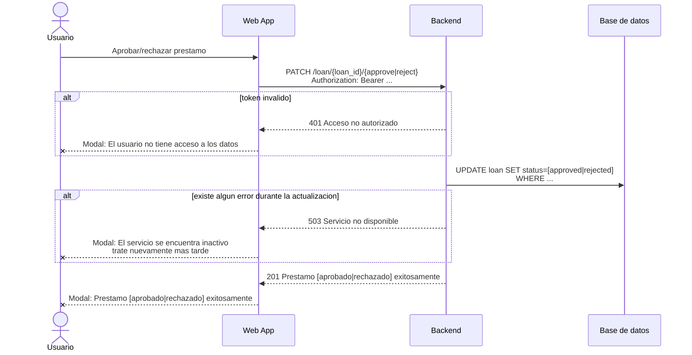

## Gestion de prestamos aprobados y pagos
### Ver prestamos aprobados
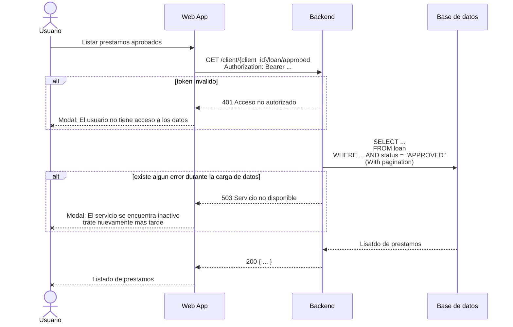
### Registrar pagos realizados
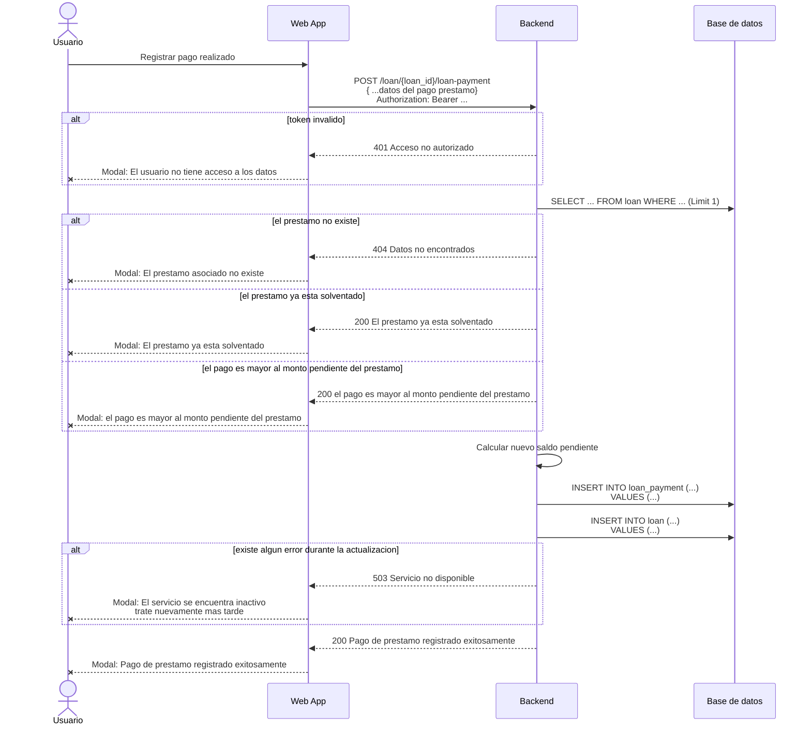
### Calcular saldos pendientes
```
    Este calculo ya se encuentre en los flujos
```


